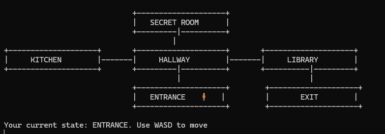
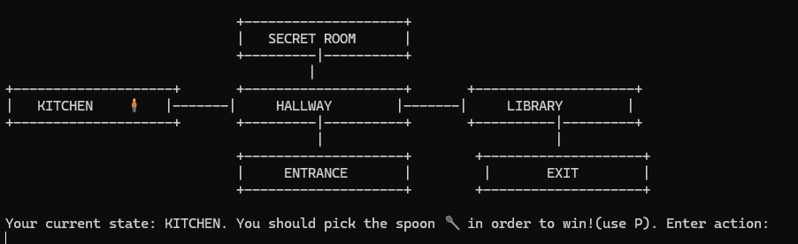
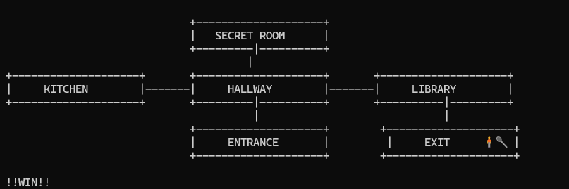

# Theory of Computation – LFA

This repository contains Python implementations of key concepts from the Theory of Computation, particularly **Formal Languages and Automata (LFA)**.  
It includes practical simulators and examples related to deterministic and nondeterministic machines.

## 📁 Project Structure

This repository is organized into the following components:

- [`DFA/`](https://github.com/dianadd03/Theory-of-computation-LFA-/tree/main/DFA) – Deterministic Finite Automata emulator
- [`NFA/`](https://github.com/dianadd03/Theory-of-computation-LFA-/tree/main/NFA) – Nondeterministic Finite Automata emulator
- [`PDA/`](https://github.com/dianadd03/Theory-of-computation-LFA-/tree/main/PDA) – Pushdown Automata emulator
- [`turing_machine/`](https://github.com/dianadd03/Theory-of-computation-LFA-/tree/main/turing_machine) – Turing Machine simulation scripts
- [`game/`](https://github.com/dianadd03/Theory-of-computation-LFA-/tree/main/game) – PDA-based terminal game with ASCII map
- [`separating_words_problem_DorneanuDD.pdf`](https://github.com/dianadd03/Theory-of-computation-LFA-/blob/main/separating_words_problem_DorneanuDD.pdf) – PDF addressing the Separating Words Problem

## 🎮 PDA-Based Game (`game/`)

This folder contains a **console-based interactive game** that uses **Pushdown Automaton (PDA)** logic to determine winning conditions.

### 🕹 Game Description
- You control a character moving through an **ASCII map** rendered in the terminal.
- To **win the game**, you must **find and pick up a hidden spoon** located in the kitchen.
- If you reach the exit without the spoon, the game will prevent you from winning — mimicking PDA-style stack validation.

### 📄 Main Script
- `pda_keys.py` – the playable version of the game using keyboard input.

### 🧩 Features
- Playable using **keyboard controls** (e.g., WASD or arrow keys).
- Stack-based PDA logic tracks your actions (e.g., item pickup).
- Fully playable inside the terminal.

### ▶️ How to Play
Run the game with the following command in your terminal:
```bash
py .\pda_keys.py
```
<p align="center">  </p> <p align="center">  </p> <p align="center">  </p> ```

